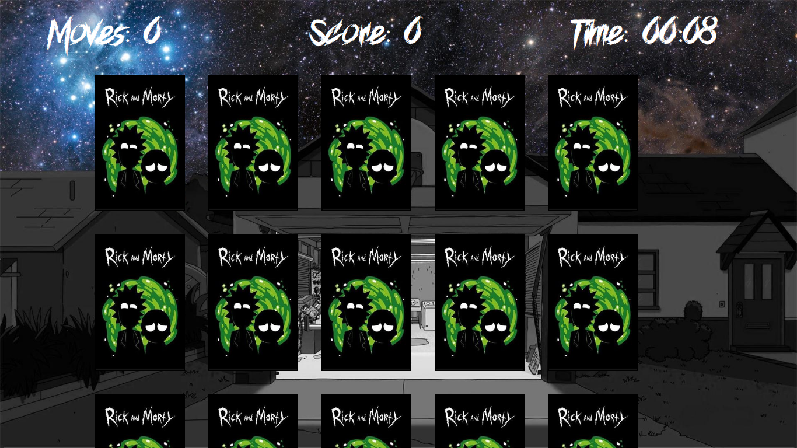
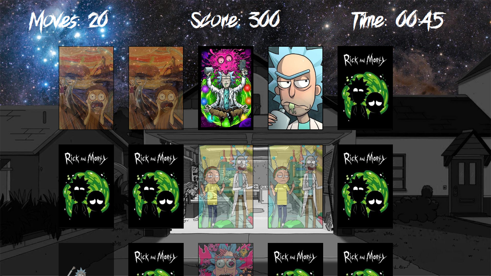
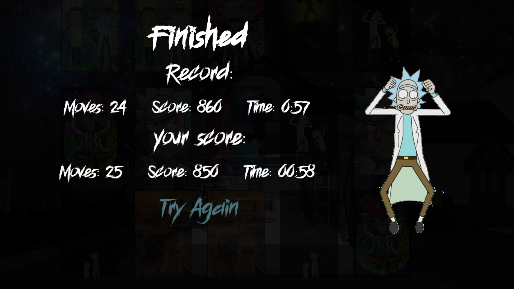

# Memory Game :clock3: :heavy_check_mark: 

## Projeto de iniciativa pessoal, onde o usuário tem que encontrar os pares das cartas. Durante a partida o tempo é cronometrado  e os movimentos contados, no fim da partida sua performasse é exibida juntamente com a seu recorde que estará salvo no localStorage do navegador, sendo assim, o usuário tem uma referência para se auto-superar.

Acesse a <a href="https://gonzagadavid.github.io/memory-card-game/" target="_blank" >Página do Projeto</a>

### Características que busquei desenvolver no projeto:

- Renderização de elementos HTML feitos utilizando javascript através do DOM;
- Armazenamento de de dados no local storage;
- Códigos organizados de acordo com suas responsabilidades em pastas;
- Exportação de arquivo através do ESModules.

### Se gostou não se esqueça da :star: motivacional :grimacing: ​
